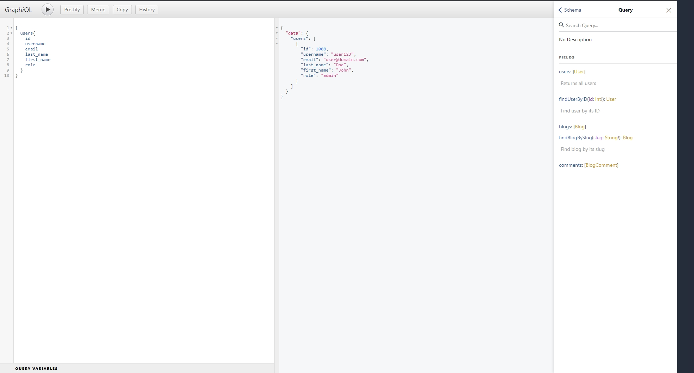

# Blog API GraphQL

## Docker environment

Prepare docker environment. Copy `.env-example` file to `.env`

```console
cp .env-example .env
```

Configure application's docker environment variables.

```
# MYSQL configuration
MYSQL_ROOT_USER=root 
MYSQL_ROOT_PASSWORD=toor
MYSQL_DATABASE=blog
MYSQL_USER=user 
MYSQL_PASSWORD=pass

MYSQL_PUBLIC_PORT=3306

# BLOG API
BLOG_API_PUBLIC_PORT=8000

```

## Running docker image

In project's root folder run in terminal.
```console
docker compose up
```
### Migrating database tables

Access database's docker container.
```console
docker exec -it <container_name> //bin/sh
```

Inside container's terminal import prepared database tables.
```console
mysql -u <MYSQL_USER> -p <MYSQL_DATABASE> < /blog_api.sql
```
Then enter `<MYSQL_PASSWORD>`

## Running application

Access Blog GraphQL API - GraphQLi to [http://localhost:8000](http://localhost:8000).




### Acessing thru curl

Use post method when accessing GraphQL API endpoint with `query` paramater.
```console
curl -X POST http://localhost:8000 -d 'query={users{username}}'
```
> Application port number may vary on your `.env`, `BLOG_API_PUBLIC_PORT`


## Database Schema


### Users

| Field      | Type         | Null | Key | Default | Extra          |
|------------|--------------|------|-----|---------|----------------|
| id         | bigint(20)   | NO   | PRI | NULL    | auto_increment |
| username   | varchar(100) | NO   | UNI | NULL    |                |
| email      | varchar(100) | NO   |     | NULL    |                |
| password   | varchar(255) | NO   |     | NULL    |                |
| first_name | varchar(100) | NO   |     | NULL    |                |
| last_name  | varchar(100) | NO   |     | NULL    |                |
| role       | varchar(50)  | NO   |     | member  |                |

### Blogs

| Field          | Type         | Null | Key | Default           | Extra          |
|----------------|--------------|------|-----|-------------------|----------------|
| id             | bigint(20)   | NO   | PRI | NULL              | auto_increment |
| slug           | varchar(255) | NO   | UNI | NULL              |                |
| author_id      | bigint(20)   | NO   | MUL | NULL              |                |
| title          | varchar(200) | NO   |     | NULL              |                |
| content        | longtext     | YES  |     | NULL              |                |
| is_published   | int(11)      | YES  |     | 0                 |                |
| published_date | datetime     | YES  |     | NULL              |                |
| created_date   | datetime     | NO   |     | CURRENT_TIMESTAMP |                |

### Comments
| Field        | Type       | Null | Key | Default           | Extra          |
|--------------|------------|------|-----|-------------------|----------------|
| id           | bigint(20) | NO   | PRI | NULL              | auto_increment |
| blog_id      | bigint(20) | NO   | MUL | NULL              |                |
| author_id    | bigint(20) | NO   | MUL | NULL              |                |
| comment      | text       | NO   |     | NULL              |                |
| created_date | datetime   | NO   |     | CURRENT_TIMESTAMP |                |
|--------------|------------|------|-----|-------------------|----------------|


**The challenge**

Create a blogging platform API capable of managing blog posts, blog authors, and blog comments. Handling user authorization is not a requirement, but a plus. No front-end is required.


You must use:

* node.js

* Typescript,

* a graphQL server,

* an RDBM system (mysql, postgreSQL, or MSSQL are all ok)

* The rest of your implementation is down to you (libraries, frameworks, etc)


For your code submission, it's preferred that you send us a link to a GIT repository showing your personal commits, rather than a zip file, but a ZIP is acceptable. Your submission should include:


* the code

* a complete README on how to run the code, including any environment variables

* the SQL schema for your database

